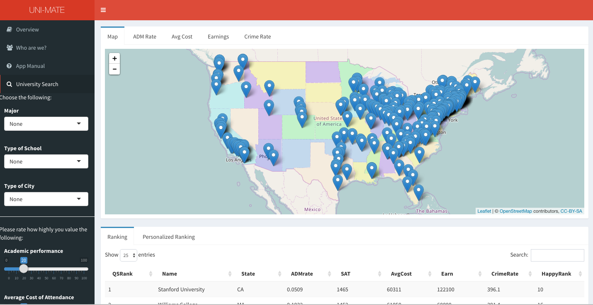
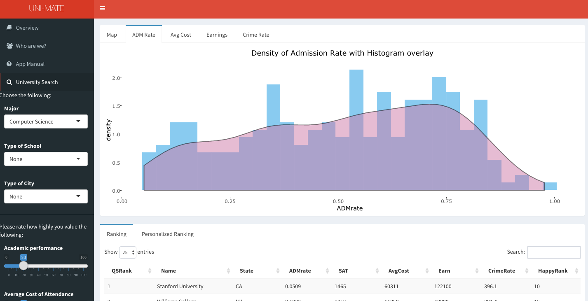

# Project 2: Open Data App - an RShiny app development project

## Project Title: UNI-MATE: Find your match! 

+ Term: Spring 2017

+ Team #10

### Team Members (Alphabetical ordering of family name)

+ Tongyue Liu ([`Tongyue Liu`](https://github.com/ltyue))
+ Yue Jin ([`Yue Jin`](https://github.com/yuejin123))
+ Yijia Pan ([`Yijia Pan`](https://github.com/panyijia1269))
+ Jia Hui Tan ([`Jiahui Tan`](https://github.com/jt2929))
+ Qingyuan Zhang([`amandazhang`](https://github.com/amandazhang))
 

### Link: https://jiahuitan.shinyapps.io/unimate/

### Background

More and more international students are choosing to study in America today. It is reported that more than 1,000,000 international students studied at U.S. colleges and universities in 2016/2017. However, the college search process is often a huge feat with all the information available everywhere in today's digital age. It is hard to sieve through all the information overload, to collect various statistics, and to collate and compare them with ease. Exact details are hard to come by easily and there is often too much inertia to sieve through thousands and thousands of datasets. In order to help students out with these issues, our team have developed an application called the Uni-Mate. This applications hopes to enable international students to discover and compare schools in an more efficient manner. It provides the user with a simplified platform to filter and rank universities based on their own preferences, and output an interactive map & various density plots that would allow them to view and compare selected statistics of the various universities. 

In a nutshell, our overall philosophy behind the creation of this application is to provide an alternative, more lighthearted and personalized platform to simplify the college decision making process for college applicants, and make it easier to obtain information amongst the sea of madness. 

### Project summary

This project explores and visualizes 272 universities in America by using the data on ([College Scorecard Database](https://collegescorecard.ed.gov/data/documentation/)), ([2016 Forbes Ranking](data/ranking_forbes_2016.csv)), ([HappyScore Data](data/Happinessdata.csv)) and ([Crime Data](data/CrimeData_final.csv)). We created a Shiny App to help users discover and compare universities. 

+ Filter & Rank——easily discover and compare the universities that meet user's requirements

Two filter parts. One part is the basic filter: the user can choose universities based on "Major", "Type of School" and "Type of City". The other part is the advanced filter: they can give their weights to "Academic Performance", "Average Cost", "Earning & Jobs", "Social Security" and "Life Quality", based on how important they think these factors matter to them. 

Two ranking options. One option is based on the Forbes University Rankings. The other one is using the weights the user gave to calculate the rank of these universities - ultimately producing a personalized ranking. 

+ Map & Plot——visualization of relevant features of the universities 

Map: Every university that meet the user's requirments will show on the map. After clicking on the university, both the URL and Forbes rank of the school will be in view.

Plots: There will be four interacitve density plots based on the filtered data. These will show the average of "Admission Rate", "Average Cost", "Crime Rate" and "Earnings" of the selected(filtered) universities.

### Outlook





### Note 
To reproduce our work, clone the whole repository onto your own local machine and then set the working directory to [`app`] folder, in your R console, run this code:
```R
runApp(getwd())
```


### **Contribution statement**: ([default](doc/a_note_on_contributions.md)) All team members contributed equally in all stages of this project. All team members approve our work presented in this GitHub repository including this contributions statement. 

Following [suggestions](http://nicercode.github.io/blog/2013-04-05-projects/) by [RICH FITZJOHN](http://nicercode.github.io/about/#Team) (@richfitz). This folder is organized as follows.

```
proj/
├── app/
├── lib/
├── data/
├── doc/
└── output/
```

Please see each subfolder for a README file.

