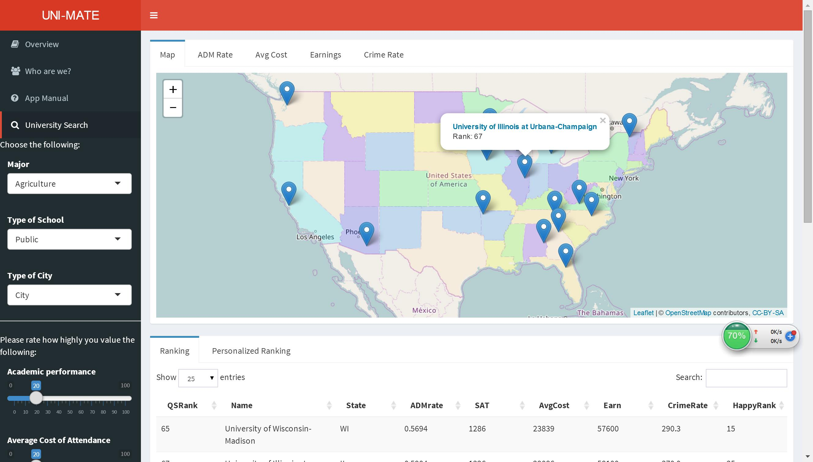

# Project 2: Open Data App - an RShiny app development project

## Project Title: Un-Mate: Find your match! 

+ Term: Spring 2017

+ Team #10

### Team Members (Alphabetical ordering of family name)

+ Tongyue Liu
+ Yue Jin
+ Yijia Pan
+ Jia Hui Tan
+ Qingyuan Zhang 

### Link: https://jiahuitan.shinyapps.io/unimate/

### Background

More and more international students are choosing to study in America today. It is reported that more than 1,000,000 international students studied at U.S. colleges and universities in 2016/2017. However, many of them complain that it is difficult to find satisfying universities when they apply for schools. There are two reasons. First, it may cost them a lot of time to collect all the information about these universities online. Second, though they can get some information online, it's still hard for them to get exact details and comprehensively learn about these universities. In order to solve these problems, our team have developed an application called Uni-Mate, which enables international students to discover and compare schools in an more efficient manner. It helps users to filter and rank universities based on their own preferences and output interactive map & plots to show the relevant features of these universities.

In a nutshell, our overall philosophy behind the creation of this application is to provide an alternative, more lighthearted and personalized platform to simplify the college decision making process for college applicants, and make it easier to obtain information amongst the sea of madness. 

### Project summary

This project explores and visualizes 272 universities in America by using the data on ([College Scorecard Database](https://collegescorecard.ed.gov/data/documentation/)), ([2016 Forbes Ranking](data/ranking_forbes_2016.csv)), ([HappyScore Data](data/Happinessdata.csv)) and ([Crime Data](data/CrimeData_final.csv)). We created a Shiny App to help users discover and compare universities. 

+ Filter & Rank——easily discover and compare the universities that meet user's requirements

Two filter parts. One part is the basic filter: they can choose universities based on "Major", "Type of School" and "Type of City". The other part is the advanced filter: they can give their weights to "Academic Performance", "Average Cost", "Earning & Jobs", "Social Security" and "Life Quality", based on how important they think these factors matter to them. 

Two ranking options. One option is based on "The 2016 Forbes University Rankings". The other one is using the weights the user gave to calculate the rank of these universities - ultimately producing a personalized ranking. 

+ Map & Plot——visualization of relevant features of the universities 

Map: Every university that meet users' requirments will show on the map. After clicking on the university, the URL of the school will be available as well as the QS rank of the school. 

Four plots. There are four interacitve density plots based on the filtered data. They will show the average of "Admission Rate", "Average Cost", "Crime Rate" and "Earnings" of those selected universities.

### Outlook



### **Contribution statement**: ([default](doc/a_note_on_contributions.md)) All team members contributed equally in all stages of this project. All team members approve our work presented in this GitHub repository including this contributions statement. 

Following [suggestions](http://nicercode.github.io/blog/2013-04-05-projects/) by [RICH FITZJOHN](http://nicercode.github.io/about/#Team) (@richfitz). This folder is organized as follows.

```
proj/
├── app/
├── lib/
├── data/
├── doc/
└── output/
```

Please see each subfolder for a README file.

